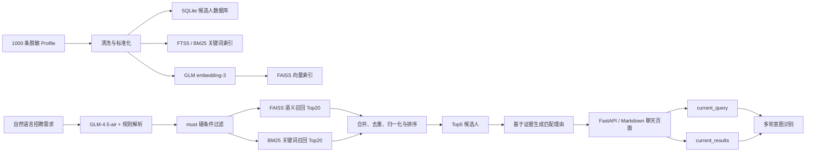

# OpenJobs Candidate Search Agent

OpenJobs Candidate Search Agent 是一个面向招聘场景的候选人搜索与筛选服务。系统基于
1000 条脱敏候选人 Profile，支持使用自然语言描述招聘需求，并返回排序后的候选人、
匹配证据和推荐理由。

除了首次搜索，系统还支持在当前结果中继续筛选、对比候选人和追问排序原因。例如：

```text
寻找至少 5 年经验的 Python 工程师，有云平台经验优先
→ 只看有 AWS 经验的候选人
→ 对比第 1 个和第 3 个
→ 第一个为什么排在前面？
→ 重新找产品经理
```

项目已经完成数据清洗、混合检索、多轮交互、HTTP 服务、聊天页面和离线排序评估。

---

## 一、架构说明

### 1.1 系统能力

系统覆盖招聘搜索中的四个主要环节：

1. **理解招聘需求**：将自然语言解析为语义查询、硬条件和优先条件。
2. **搜索并排序候选人**：结合结构化过滤、关键词检索和语义检索生成候选人排名。
3. **解释结果**：展示与招聘需求相关的候选人信息、条件证据和推荐理由。
4. **支持多轮招聘操作**：在当前结果中继续筛选、比较候选人或追问排名依据。

### 1.2 总体架构



### 1.3 数据清洗与存储

原始数据包含 `headline`、`summary`、`skills`、`experience`、`education`、
证书、课程、奖项等字段，同时存在缺失值、空字符串、重复技能、网页抓取残留和异常时间。

清洗规则包括：

- 统一 Unicode、连续空白和零宽字符。
- 移除 `Show more`、`Show less` 等网页抓取残留。
- 将空字符串转为缺失值，将集合字段统一为列表。
- 对技能等列表去空、去重，并保持原始顺序。
- 将 `company_size_range=-1` 等哨兵值视为未知。
- 检查负数工作时长、非法年月和结束时间早于开始时间等异常。
- 保留 `MASKED` 等脱敏内容，不虚构缺失信息。
- 同时保存原始 JSON、清洗后 JSON 和清洗告警，便于追溯。

清洗后的数据存储在 SQLite：

- `candidates`：候选人主数据、metadata、原始及清洗后 JSON、检索文本。
- `candidate_fts`：SQLite FTS5/BM25 关键词索引。
- `embedding_cache`：按候选人、模型和内容哈希缓存向量，支持失败后续跑。

独立索引文件包括：

- `data/indexes/candidates.faiss`：1000 条、2048 维的 FAISS 向量索引。
- `data/indexes/candidates.manifest.json`：FAISS 行号与 `candidate_id` 的映射。

### 1.4 查询理解

系统将用户输入解析成：

```json
{
  "semantic_query": "Python engineer with cloud platform experience",
  "metadata_filter_must": [
    {
      "field": "total_experience_years",
      "operator": "gte",
      "value": 5
    },
    {
      "field": "skills",
      "operator": "in",
      "value": ["Python", "Python3", "Django", "Flask", "FastAPI"]
    }
  ],
  "metadata_filter_should": [
    {
      "field": "skills",
      "operator": "in",
      "value": ["AWS", "GCP", "Azure", "cloud platform"]
    }
  ]
}
```

- `must`：必须满足，不满足直接淘汰，例如工作年限、明确技能、学历或状态。
- `should`：优先项，命中则加分，不命中不会淘汰。
- `semantic_query`：保留完整岗位语义，用于向量检索和 BM25 检索。

GLM-4.5-air 负责查询理解，代码中同时提供常见技能、年限和意图的规则兜底。

### 1.5 字段路由与证据来源

招聘 Profile 中同一个事实可能出现在多个合理位置。例如 Python 可能出现在技能列表，
也可能只出现在项目经历描述中。因此系统没有简单地对整份简历做无边界关键词匹配，
而是采用“主字段 + 合理辅助字段”的受控路由：

| 查询字段 | 搜索范围 |
|---|---|
| `skills` | 技能列表、经历描述、Summary、职位标题、Headline |
| `roles` | 当前职位、历史职位、Headline、标准角色 |
| `industries` | Industry、公司标签、经历描述、Summary |
| `companies` | 公司名称、经历描述、Summary |
| `locations` | 结构化地点、经历地址、Summary |
| `majors` | 专业、学位描述、课程 |
| `certifications` | 证书、Summary、经历描述 |
| `experience_descriptions` | 仅工作经历描述，避免概念漂移 |

英文字母匹配忽略大小写。技能还会进行受控的常见变体扩展，例如：

```text
Python → Python / Python3 / Django / Flask / FastAPI
Java   → Java / J2EE / Spring / Spring Boot
SQL    → SQL / MySQL / PostgreSQL / T-SQL
Cloud  → AWS / GCP / Azure / cloud platform
```

“前端、后端、全栈”这类边界较宽的岗位方向不作为绝对过滤条件，而保留在
`semantic_query` 中参与语义和关键词排序，避免因为职位命名不同而误删候选人。

### 1.6 混合召回与排序

硬条件过滤后，系统并行执行：

- FAISS 语义搜索 Top20
- BM25 关键词搜索 Top20

两路结果合并去重，并分别归一化到 0–1，最终分数为：

```text
final_score =
0.35 × vector_score
+ 0.35 × bm25_score
+ 0.30 × metadata_should_score
```

这样能够同时兼顾：

- **语义理解**：用户没有使用简历原词时，仍能找到含义接近的候选人。
- **关键词精度**：具体技能、岗位名称和行业词能够获得明确匹配。
- **招聘偏好**：云平台、行业背景、证书等优先条件直接影响排序。

### 1.7 推荐理由与可解释性

系统将 Top5 候选人的原始资料、硬条件命中证据、优先条件命中信息和分数组成提供给
GLM-4.5-air，由模型生成面向招聘人员的 Markdown 回答。

理由生成受到以下约束：

- 优先介绍与当前 Query 最相关的信息。
- 必须依据系统提供的字段证据，不能重新猜测候选人是否掌握某技能。
- 不将向量相似度或 BM25 命中直接描述成候选人的真实能力。
- 不根据公司名称推断资料中没有写明的技能，例如“在 Amazon 工作”不等于“具备 AWS
  经验”。
- 明确展示硬条件、优先条件、优势、缺口和综合分。

### 1.8 多轮交互

每个 `conversation_id` 只维护两个核心状态：

- `current_query`：当前完整招聘需求。
- `current_results`：当前页面展示的候选人结果。

支持四类意图：

| 意图 | 示例 | 系统行为 |
|---|---|---|
| `new_search` | “重新找产品经理” | 清空原状态，执行完整检索 |
| `refine` | “只看有 AWS 经验的” | 只在当前结果中继续过滤和重排 |
| `compare` | “对比第一个和第三个” | 定位候选人并按当前 Query 对比 |
| `follow_up` | “第一个为什么排第一？” | 根据当前结果和排序证据解释 |

LLM 负责识别意图、重写完整查询和生成自然语言回答；候选人定位、结果范围控制、过滤和
排序均由代码执行。

### 1.9 服务结构

```text
backend/app/
├── ingestion/
│   ├── cleaning.py       # 数据清洗
│   ├── documents.py      # Document、page_content、metadata
│   ├── storage.py        # SQLite 与 BM25
│   ├── embeddings.py     # embedding-3 与 FAISS
│   └── pipeline.py       # 数据导入流程
├── rag/
│   ├── query_parser.py   # 查询解析和 Few-Shot
│   ├── retriever.py      # 字段过滤、混合召回、融合排序
│   ├── conversation.py   # 多轮状态和意图识别
│   ├── service.py        # RAG 与多轮流程编排
│   ├── glm.py            # 异步 GLM 客户端
│   └── models.py         # 数据模型
└── main.py               # FastAPI 和聊天页面

scripts/
├── ingest_profiles.py
├── test_rag.py
├── test_multiturn.py
└── evaluate_judge_ranking.py
```

---

## 二、运行方式

### 2.1 环境要求

- Python 3.11 或更高版本
- 智谱开放平台 API Key
- macOS、Linux 或其他能够运行 Python、SQLite 和 FAISS 的环境

模型配置：

- 查询解析、意图识别、对比、追问和理由生成：`glm-4.5-air`
- 候选人向量编码：`embedding-3`

### 2.2 安装

在项目根目录执行：

```bash
python -m venv .venv
./.venv/bin/python -m pip install -e '.[dev]'
cp .env.example .env
```

在 `.env` 中填写：

```bash
ZHIPUAI_API_KEY=你的 API Key
GLM_CHAT_MODEL=glm-4.5-air
EMBEDDING_MODEL=embedding-3
```

### 2.3 初始化候选人数据库和索引

完整导入、清洗并生成 embedding：

```bash
./.venv/bin/python scripts/ingest_profiles.py
```

该命令会生成：

```text
data/processed/candidates.cleaned.jsonl
data/processed/candidates.db
data/indexes/candidates.faiss
data/indexes/candidates.manifest.json
```

如果只需要清洗和 BM25，不调用 embedding API：

```bash
./.venv/bin/python scripts/ingest_profiles.py --skip-embeddings
```

当前仓库中的数据处理结果：

- 原始记录：1000 条
- 成功存储：1000 条
- FAISS 向量：1000 条
- 向量维度：2048
- 需要人工关注的清洗异常：5 条记录、6 个告警

### 2.4 一键启动服务

索引准备完成后，只需一条命令：

```bash
./.venv/bin/uvicorn backend.app.main:app --host 0.0.0.0 --port 8000
```

打开浏览器：

```text
http://127.0.0.1:8000
```

健康检查：

```bash
curl http://127.0.0.1:8000/health
```

预期返回：

```json
{"status": "ok"}
```

### 2.5 HTTP API

接口：

```text
POST /api/chat
```

首次查询：

```bash
curl -X POST http://127.0.0.1:8000/api/chat \
  -H "Content-Type: application/json" \
  -d '{
    "message": "寻找至少5年经验的Python工程师，有云平台经验优先"
  }'
```

响应会包含 `conversation_id`。后续请求传入相同 ID 即可继续当前会话：

```bash
curl -X POST http://127.0.0.1:8000/api/chat \
  -H "Content-Type: application/json" \
  -d '{
    "conversation_id": "首次响应中的 conversation_id",
    "message": "只看有AWS经验的候选人"
  }'
```

响应主要字段：

```json
{
  "conversation_id": "...",
  "intent": "refine",
  "current_query": "...",
  "parsed_query": {},
  "candidates": [],
  "answer": "Markdown 回答"
}
```

### 2.6 测试与调试

运行全部测试：

```bash
./.venv/bin/python -m pytest -q
```

代码静态检查：

```bash
./.venv/bin/python -m ruff check backend scripts tests
```

当前结果：

```text
21 passed
All checks passed
```

单轮命令行测试：

```bash
./.venv/bin/python scripts/test_rag.py \
  "寻找至少5年经验的Python工程师，有云平台经验优先"
```

多轮测试：

```bash
./.venv/bin/python scripts/test_multiturn.py
```

离线排序评估：

```bash
./.venv/bin/python scripts/evaluate_judge_ranking.py
```

评估输出：

```text
reports/judge_ranking_eval_results.json
reports/judge_ranking_eval_report.md
```

---

## 三、设计取舍

### 3.1 为什么使用混合检索，而不是只用大模型或向量搜索

纯向量搜索擅长理解语义，但可能忽略明确的年限、技能或学历要求；纯关键词搜索精确，
但无法处理同义表达和自然语言变化。

因此系统采用：

- SQL/metadata：保证硬条件。
- BM25：保证具体关键词匹配。
- FAISS 向量：处理语义相似和表达差异。
- LLM：负责理解需求和解释结果，而不直接控制底层数据筛选。

这种分工降低了大模型“说得合理但筛错人”的风险。

### 3.2 为什么采用 must / should

招聘需求通常同时包含不可妥协条件和偏好条件：

```text
至少 5 年经验        → must
掌握 Python          → must
有 AWS 经验优先      → should
```

如果所有条件都作为硬过滤，数据较少时容易没有结果；如果所有条件都只参与语义排序，
不满足核心要求的候选人又可能进入前列。must/should 在准确率和候选人覆盖之间提供了
清晰、可解释的平衡。

### 3.3 为什么使用受控字段路由

关键词可能出现在多个合理字段，但不能无限扩散。例如 Python 可以出现在技能列表或项目
描述中，却不应该因为学校名称包含 Python 而算作技能。

系统为每类条件预先定义主字段和辅助字段，并确保 SQL 初筛与最终证据检查共享同一套路由
配置。这样既提高召回率，也防止跨字段误判。

### 3.4 为什么不把“前端/后端/全栈”作为绝对过滤

候选人的职位标题非常不统一：

```text
Backend Engineer
Software Engineer
Application Architect
Web Developer
```

许多实际从事后端开发的人不会在职位标题中写 `Backend`。因此这类宽泛方向保留在语义
查询中参与排序，而 Python、SQL、工作年限等更明确条件仍可作为硬过滤。

### 3.5 为什么由代码排序、由 LLM 解释

LLM 适合理解自然语言、重写查询和生成招聘人员可读的说明，但不适合直接承担数据库过滤、
候选人定位和确定性排序。

项目遵循以下边界：

- LLM：意图识别、条件解析、查询重写、对比和解释。
- 代码：SQL 过滤、FAISS/BM25 检索、分数计算、序号定位和状态更新。

这使搜索结果更容易复现、调试和评估。

### 3.6 为什么会话只保存两个状态

系统只维护 `current_query` 和 `current_results`，没有把整段聊天历史无限传给模型。

优势：

- 状态简单，便于调试。
- 降低 Token 消耗和延迟。
- 减少历史对话对新查询的干扰。
- “继续筛选”天然限制在当前结果范围内。

当前会话存储位于进程内存，服务重启后自动清空。生产环境可替换为 Redis，而不需要改变
核心检索流程。

### 3.7 为什么选择 SQLite、FTS5 和 FAISS

本项目只有 1000 条候选人数据：

- SQLite 无需额外部署数据库，适合快速交付和本地运行。
- FTS5 内置 BM25，足够支撑当前数据规模。
- FAISS 本地向量搜索速度快，部署简单。

如果数据扩展到数十万或百万级，可将 SQLite/FTS5 替换为 PostgreSQL、Elasticsearch
或 OpenSearch，将 FAISS 替换为 Qdrant、Milvus 等向量数据库。

### 3.8 性能取舍

系统使用一个共享的 `httpx.AsyncClient` 连接池，复用 GLM API 的 HTTPS 连接。

查询解析完成后：

- Query embedding/FAISS 搜索
- SQLite BM25 搜索

通过 `asyncio.gather` 并行执行。SQLite 和 FAISS 的阻塞操作被放到工作线程，避免阻塞
FastAPI 事件循环。

### 3.9 当前限制

- 数据集只有 1000 条，部分细分需求可能没有满足全部硬条件的候选人。
- Profile 为脱敏数据，没有候选人姓名，只能使用 `candidate_id`。
- 原始字段存在缺失，未写出的技能不能被视为候选人一定不会。
- 同义词扩展目前覆盖常见技术栈，仍可继续建设领域词典。
- 会话状态目前存储于单进程内存，不适用于多实例共享。
- 推荐理由和 Judge 都依赖外部模型，模型判断不等同于人工招聘决策。
- 本系统用于辅助筛选，不应代替人工面试、背景调查或最终录用决策。

---

## 四、评估结果

### 4.1 评估目标

评估重点不是判断大模型写出的推荐理由是否好看，而是验证：

> 系统排在前面的候选人，是否也是独立 Judge 根据招聘需求认为更相关的人。

评估过程不调用最终推荐理由生成逻辑，避免推荐文案影响 Judge。

### 4.2 评估方法

测试集位于 `data/eval_queries.json`，包含 10 条典型招聘需求，覆盖：

- Python、Java、SQL、机器学习等技能搜索
- 云平台、DevOps 和微服务
- 产品、项目、医疗账单、财务会计等不同岗位方向
- 年限等硬条件
- 行业、平台和经验等优先条件

对每条查询：

1. 系统执行查询解析、metadata 过滤、向量检索、BM25 检索和融合排序。
2. 取系统 Top10，并随机打乱顺序。
3. 将原始 Query 和打乱后的候选人资料交给 GLM-4.5-air Judge。
4. Judge 看不到系统原始排名、`final_score` 或任何分项得分。
5. Judge 对候选人重新排序。
6. 将 Judge Top5 视为弱监督强相关集合，评价系统原始排序。

本评估使用 LLM-as-a-judge 对候选人 Top10 进行相对排序，Judge Top5 被视为弱监督
强相关集合，用于快速评估系统排序质量。

### 4.3 指标说明

| 指标 | 招聘场景含义 |
|---|---|
| Top5 Overlap | 系统前 5 名中，有多少也被 Judge 认为属于最相关候选人 |
| nDCG@10 | Judge 认为相关的人是否整体排在系统结果前部 |
| MRR | Judge 认为最优的候选人在系统排名中出现得有多靠前 |

指标范围均为 0–1，越高越好。

需要注意：当系统因为硬条件只返回少于 5 人时，Top5 Overlap 仍按固定分母 5 计算。
因此某些查询虽然系统与 Judge 对所有返回候选人完全一致，Overlap 仍可能显示为 0.6。

### 4.4 实际结果

评估运行时间：2026-06-25

Judge 模型：`glm-4.5-air`

Embedding 模型：`embedding-3`

| 指标 | 结果 |
|---|---:|
| 总查询数 | 10 |
| 成功评估查询 | 9 |
| 无候选人/未计入均值 | 1 |
| Mean Top5 Overlap | **0.6889** |
| Mean nDCG@10 | **0.9858** |
| Mean MRR | **0.6944** |

### 4.5 如何理解结果

#### nDCG@10：0.9858

这是本次评估中最强的指标。它表示 Judge 认为相关的候选人几乎都集中在系统排序前部。
换句话说，系统的整体排序方向与独立 Judge 高度一致。

#### Top5 Overlap：0.6889

平均约 68.9% 的前 5 名候选人与 Judge Top5 重合。该数字受到“部分查询只返回 3–4
名候选人，但仍除以 5”的影响，因此对当前数据集略显保守。

#### MRR：0.6944

Judge 认为最优的候选人通常出现在系统前几位。9 个成功查询中：

- 5 个查询的 Judge 第一名也是系统第一名。
- 部分查询的候选集合正确，但第一名次序仍有优化空间。

例如 Python 查询中，Judge 第一名位于系统第 4；财务会计查询中，Judge 第一名位于
系统第 6。这说明当前系统对相关候选人的召回较好，但向量、BM25 和 should 的权重仍可
针对特定领域继续校准。

### 4.6 失败案例与发现

查询：

```text
找有政府合同或国防项目经验的项目经理，具备团队管理经验优先。
```

系统没有返回候选人，因此该查询标记为 `judge_failed=true`，未进入平均指标。

这并不是 Judge JSON 解析失败，而是当前硬条件解析和字段路由在 1000 条数据上形成了
空结果。该案例说明：

- 数据集中可能没有同时明确写出“项目经理”和“政府合同/国防项目”的候选人。
- 当前 `experience_descriptions` 硬条件可能偏严格。
- 后续可考虑在无结果时提供“放宽条件并标注缺口”的补充召回模式。

### 4.7 代表性结果

- Java + Spring Boot + 微服务：系统与 Judge 对全部 3 名候选人的排序完全一致。
- SQL 数据分析：系统与 Judge 对全部 3 名候选人的排序完全一致。
- DevOps / 云工程：系统第一名与 Judge 第一名一致。
- 软件架构师：系统与 Judge 对全部 3 名候选人的排序完全一致。
- 产品经理：Top5 重合率 0.8，但第 5/6 名存在交换。
- Python 与财务会计：相关集合重合较高，但第一名排序存在改进空间。

### 4.8 评估局限

该评估用于快速验证排序质量，但不是最终人工招聘评价：

- Judge 使用 LLM，而不是招聘专家人工标注。
- Judge Top5 是弱监督相关集合，不是客观唯一答案。
- 系统和 Judge 使用同一家模型体系，可能存在相似偏好。
- 只有 10 条查询，适合项目验收和快速迭代，不代表所有招聘场景。
- 对只返回少于 5 人的查询，固定分母会压低 Top5 Overlap。

后续可增加人工标注查询集，并补充 Precision@5、Recall@20、硬条件违规率和不同检索
方案的消融对比。

完整评估文件：

- [JSON 明细](reports/judge_ranking_eval_results.json)
- [Markdown 报告](reports/judge_ranking_eval_report.md)
